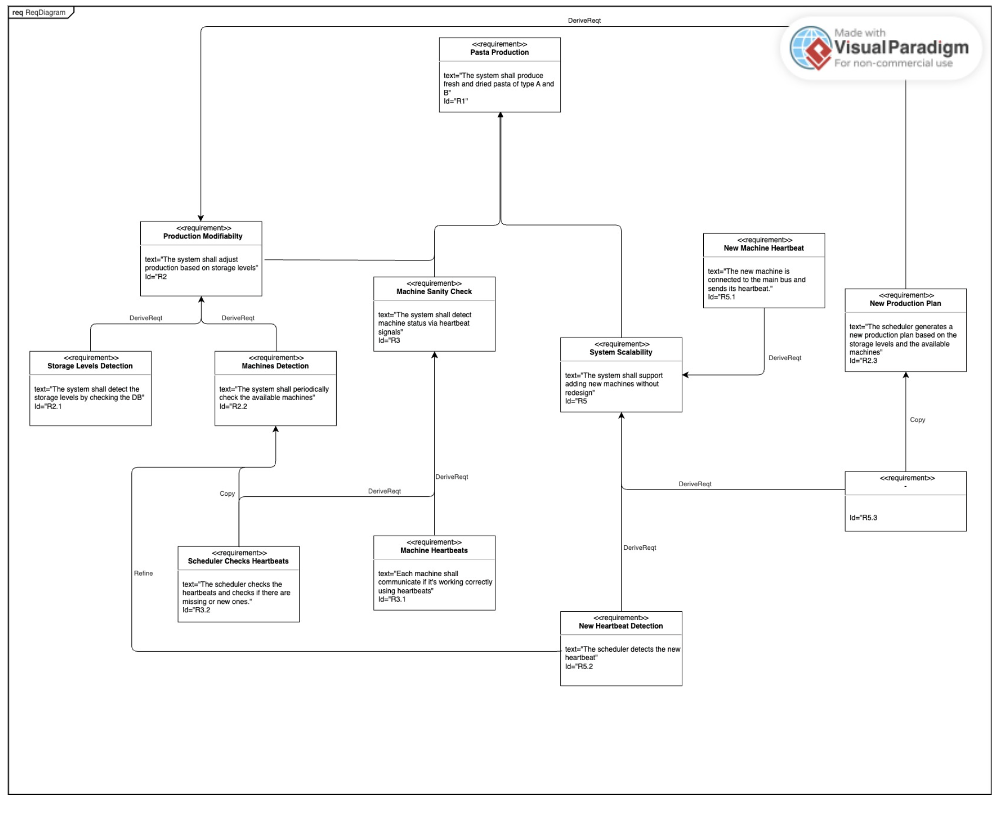

# Use Case Descriptions

---

## UC1: Storage Level-Based Production Adjustment

**Actors:** Storage Sensor, Production Scheduler  
**Preconditions:** Pasta products (fresh or dried, type A or B) are being produced and stored; warehouse sensors are active and reporting fill levels.  

**Steps:**
- Storage sensors continuously monitor fill levels of all storage units (fresh/dried, product A/B).  
- A sensor detects that a specific storage unit has reached a threshold:  
  - **If over 80% →** trigger reduction or pause in production.  
  - **If under 20% →** trigger increase in production.  
- Monitoring Subsystem sends alert to the Scheduler.  
- Scheduler evaluates current production rate, machine availability, and demand.  
- Scheduler sends updated commands to:  
  - Cutting machines (e.g., blade switch if needed)  
  - Sorting manager (to route batches accordingly)  
  - Kneading machines (to adjust dough production)  
- Production is adjusted dynamically to match storage needs.  

**Postconditions:** Production is optimized based on real-time storage capacity, preventing overfilling or understocking.

---

### UC1.A: Fresh Storage of Product A is 80% Filled

**Actors:** Storage Sensor, Production Scheduler  
**Preconditions:** Fresh pasta type A is being produced and stored; warehouse sensor is active.  

**Steps:**
- Sensor detects that fresh pasta type A storage is 80% full.  
- Sensor sends alert to the Production Scheduler.  
- Scheduler evaluates current production rate and demand.  
- Scheduler sends command to reduce or pause production of fresh pasta type A.  
- Cutting and sorting machines are updated with new instructions.  

**Postconditions:** Production of fresh pasta type A is reduced or stopped to prevent overfilling.

---

### UC1.B: Dried Storage of Product B is Below 20%

**Actors:** Storage Sensor, Production Scheduler  
**Preconditions:** Dried pasta type B is being produced and stored; warehouse sensor is active.  

**Steps:**
- Sensor detects that dried pasta type B storage is below 20%.  
- Sensor sends alert to the Production Scheduler.  
- Scheduler checks machine availability and current production plan.  
- Scheduler increases production of dried pasta type B.  
- Scheduler updates cutting machine blade type and sorting manager to route batches to drying.  

**Postconditions:** Production of dried pasta type B is increased to meet storage needs.

---

## UC2: Cutting Machine Blade Switch 

**Actors:** Production Scheduler, Cutting Machine  
**Preconditions:** A new batch requires a different pasta type (A or B); cutting machine is idle or in transition.  

**Steps:**
- Scheduler notices that the storage levels are not balanced.  
- Scheduler stops the dough machine.  
- Scheduler changes compressor polarity to stop the dough.  
- Scheduler sends blade switch command to the cutting machine.  
- Cutting machine finishes the dough already in it and performs the blade switch.  
- Machine confirms blade switch.  
- Scheduler reactivates the compressor.  

**Postconditions:** Cutting machine is configured with the correct blade for the next batch.

---

## UC3: Compressor Failure in Dough Pipe 

**Actors:** Dough Machine Sensor, Maintenance Team, Production Scheduler  
**Preconditions:** Dough machine is actively kneading and sending dough through the pipe; compressor is operational.  

**Steps:**
- Sensor detects abnormal pressure or failure in the dough pipe compressor.  
- Alert is sent to the Production Scheduler and Maintenance Team.  
- Scheduler pauses the affected dough machine to prevent overflow or damage.  
- Scheduler slows the other machines to give maintenance more time.  
- Maintenance team is dispatched to inspect and repair the compressor.  
- Once fixed, the dough machine resumes operation.  

**Postconditions:** Compressor is repaired or rerouted, and dough machine resumes production safely.

---

## UC5: Dough Machine Sensor Reports Error 

**Actors:** Dough Machine Sensor, Production Scheduler, Maintenance Team  
**Preconditions:** Dough machine is operational and monitored by sensors.  

**Steps:**
- Sensor detects an error (e.g., overheating, mechanical fault).  
- Alert is sent to the Production Scheduler and Maintenance Team.  
- Scheduler stops the compressor.  
- Scheduler reduces productivity of other machines to avoid overproduction.  
- Maintenance team investigates and resolves the issue.  
- Once resolved, scheduler gradually restores normal productivity.  

**Postconditions:** Fault is addressed, and production is balanced across machines.

---

## UC6: Schedule Software Update for Machine Sensors

**Actors:** Production Scheduler, Digital Twin System, Machine Controller  
**Preconditions:** A new software version is available and validated; machine is not critical at the moment.  

**Steps:**
- Scheduler receives notification of a new software update.  
- Update is first deployed to the **digital twin** of the target machine.  
- Digital twin runs simulations to verify stability and compatibility.  
- If successful, scheduler selects one machine to take offline.  
- Update is applied to the offline machine.  
- Machine is tested live and returned to production.  
- Scheduler repeats the process for remaining machines, one at a time.  

**Postconditions:** All machines are updated with minimal disruption to production.

---

## UC7: Batch Sorting Decision 

**Actors:** Sorting Manager, Production Scheduler  
**Preconditions:** A batch of pasta has been cut and is ready for sorting; batch ID is assigned.  

**Steps:**
- Sorting Manager receives batch information (type + freshness).  
- Manager decides if the batch should be dried or packaged directly.  
- Batch is routed to either:  
  - **Drying machine** (for dried pasta)  
  - **Packaging machine** (for fresh pasta)  
- Sorting Manager updates the batch status in the system.  

**Postconditions:** Batch is correctly routed to the next stage.

---

## UC8: Packaging Machine Receives Batch ID 

**Actors:** Packaging Machine, Sorting Manager  
**Preconditions:** Batch has completed sorting and (if needed) drying; batch ID is available.  

**Steps:**
- Packaging machine receives the batch.  
- Machine reads the batch ID and retrieves metadata (type, freshness, expiration date).  
- Machine prints the correct label and expiration date.  
- Packaged pasta is routed to the correct storage area.  

**Postconditions:** Pasta is correctly labeled and routed to the correct storage.

---

## UC9: User Interface Request for Machine Status

**Actors:** Operator, Monitoring System  
**Preconditions:** Machines are operational and connected to the monitoring system.  

**Steps:**
- Operator logs into the UI.  
- Operator selects a machine or group to view status.  
- Monitoring system displays:  
  - Operational status  
  - Error alerts  
  - Productivity level  
  - Maintenance history  
- Operator can acknowledge alerts or schedule maintenance.  

**Postconditions:** Operator has full visibility into machine health and performance.

---

## UC10: Cutting Machine Failure Recovery

**Actors:** Cutting Machine Sensor, Production Scheduler  
**Preconditions:** Cutting machine is active and sensors are monitoring its health.  

**Steps:**
- Sensor detects failure.  
- Alert sent to Production Scheduler and Maintenance Team.  
- Scheduler identifies available cutting machines.  
- Scheduler switches blades on other machines to continue production.  
- Once repaired, the affected machine is reconfigured and resumed.  

**Postconditions:** Cutting continues with minimal disruption.

---

## **UC11: Packaging Machine Failure Recovery **

**Actors:** Packaging Machine Sensor, Production Scheduler  
**Preconditions:** Packaging machine is operational and receiving batches.  

**Steps:**
- Sensor detects failure.  
- Alert sent to Production Scheduler and Maintenance Team.  
- Scheduler calculates estimated recovery time.  
- Scheduler slows upstream production to prevent backlog.  
- Once repaired, scheduler resumes normal speed.  

**Postconditions:** Production is synchronized with packaging recovery.

---

## UC12: Change in Machine Status

**Actors:** Machines, Monitoring Subsystem, Production Scheduler, Cutting Machines, Sorting Subsystem  
**Preconditions:** All machines are operational and periodically sending heartbeat signals on the communication bus.  

**Steps:**
- Each machine sends heartbeat signals to indicate status.  
- Monitoring Subsystem maintains a live status map of all machines.  
- If a heartbeat is missing or a new machine joins, subsystem detects the change.  
- Monitoring Subsystem sends status update to Production Scheduler.  
- Scheduler:  
  - Generates a new production plan.  
  - Sends blade change commands to cutting machines if needed.  
  - Updates Sorting Subsystem on how to route pasta batches.  
- All components adjust accordingly.  

**Postconditions:**  
- System adapts dynamically to machine availability.  
- Production continues with minimal disruption.  
- All components are synchronized with the new plan.

 --- 
  # Systems and Subsystems
  - **Management system:** Scheduler, Batch ID Assigner, Update Manager, Monitoring System, Database.
  - **Production System:** Kneading Machine, Cutting Machines, Sorting Subsystem, Drying Machine, Packaging Machine, Conveyor Belts, Compressor.

  - **Storage System:** Dryed Pasta Warehouse, Fresh Pasta Warehouse, Recipients Warehouse.
---
  ## Quality Attributes

| Use Case | Quality Attributes |
|-----------|--------------------|
| UC1  | Modifiability, Availability |
| UC6  | Deployability, Availability |
| UC12 | Scalability, Integrability, Availability, Modifiability |

**Quality Attribute Definitions**
- **Modifiability** – Ease of making changes without introducing defects.  
- **Availability** – Degree to which the system is operational and accessible when required.  
- **Deployability** – Ease and reliability of deploying updates or new components.  
- **Scalability** – Ability to handle growth in workload or system size.  
- **Integrability** – Ease of integrating new components or external systems.
---

# Requirements

| ID | Name | Text |
|----|------|------|
| R1 | Pasta Production | The system shall produce fresh and dried pasta of type A and B |
| R1.1 | Pasta A Production | The system shall produce fresh and dried pasta of type A |
| R1.1.1 | Fresh Pasta A Production | The system shall produce fresh pasta of type A |
| R1.1.2 | Dried Pasta A Production | The system shall produce dried pasta of type A |
| R1.2 | Pasta B Production | The system shall produce fresh and dried pasta of type B |
| R1.2.1 | Fresh Pasta B Production | The system shall produce fresh pasta of type B |
| R1.2.2 | Dried Pasta B Production | The system shall produce dried pasta of type B |
| R2 | Production Modifiability | The system shall adjust production based on storage levels |
| R2.1 | Storage Levels Detection | The system shall detect the storage levels by checking the DB |
| R2.2 | Machines Detection | The system shall periodically check the available machines |
| R2.3 | New Production Plan | The scheduler generates a new production plan based on the storage levels and the available machines |
| R3 | Machine Sanity Check | The system shall detect machine status via heartbeat signals |
| R3.1 | Machine Heartbeats | Each machine shall communicate if it's working correctly using heartbeats |
| R3.2 | Scheduler Checks Heartbeats | The scheduler checks the heartbeats and checks if there are missing or new ones. |
| R4 | Software Updatability | The system shall allow software updates with minimal downtime |
| R4.1 | Machine Update | A machine shall be updated with a small downtime |
| R4.1.1 | Update Request | The update manager tells the scheduler which machine has to be updated |
| R4.1.2 | As R2.3 |  |
| R4.1.3 | Update Phase | The machine receives the updates, execute it and sends its heartbeat when it's ready |
| R4.2 | Scheduler Update | The scheduler has to be updated without stopping the production |
| R4.2.1 | Shadow Scheduler Takes Control | The shadow scheduler takes the scheduler place |
| R4.2.2 | Scheduler Update Phase | The scheduler receives the update and executes it |
| R4.2.3 | Scheduler Takes Control | The scheduler comes back alive and takes control of the system |
| R4.2.4 | Shado Scheduler Update Phase | The shadow scheduler receives the update and execute it |
| R5 | System Scalability | The system shall support adding new machines without redesign. |
| R5.1 | New Machine Heartbeat | The new machine is connected to the main bus and sends its heartbeat. |
| R5.2 | New Heartbeat Detection | The scheduler detects the new heartbeat |
| R5.3 | New Production Plan | As R2.3 |

We need to focus only on one (or at most two) requirement, translate it into feature and draw the feature model. Then pass to the analysis model (SM?)

The focus should be on R2, R3 and R5.

--- 
## Requirement Relationships

| Requirement A | Requirement B | Relationship Type |
|----------------|----------------|-------------------|
| R2  | R2.1 | Derive |
| R2  | R2.2 | Derive |
| R2  | R2.3 | Derive |
| R3  | R3.1 | Derive |
| R3  | R3.2 | Derive |
| R5  | R5.1 | Derive |
| R5  | R5.2 | Derive |
| R5  | R5.3 | Derive |
| R2.2 | R3.2 | Copy |
| R2.3 | R5.3 | Copy |
| R2.2 | R5.2 | Refine |

## Features 
  **ProductionModifiability (for R2, R3 and R5)**
  - DetectStorageLevels
  - DetectMachines
  - GenerateProductionPlan
  - PublishProductionPlan
  - SendHeartbeat (for machines)

---

#     Organizing requirement table to functional and non-functional requirements
| ID  | Name                       | Description                                                                                                   | Functional | Non-functional | Priority |
|-----|-----------------------------|----------------------------------------------------------------------------------------------------------------|-------------|-----------------|-----------|
| R1  | Fresh Pasta A Production    | The system shall produce fresh pasta of type A                                                                | x           |                 | High      |
| R2  | Dried Pasta A Production    | The system shall produce dried pasta of type A                                                                | x           |                 | High      |
| R3  | Fresh Pasta B Production    | The system shall produce fresh pasta of type B                                                                | x           |                 | High      |
| R4  | Dried Pasta B Production    | The system shall produce dried pasta of type B                                                                | x           |                 | High      |
| R5  | Production Modifiability    | The system shall adjust production based on the current system state                                          |             | x               | High      |
| R6  | Machine Heartbeats          | Each machine shall communicate if it's working correctly using heartbeats                                     | x           |                 | High      |
| R7  | Scheduler Checks Heartbeats | The scheduler checks the heartbeats and checks if there are missing or new ones.                              | x           |                 | High      |
| R8  | Software Deployability      | The system shall allow software updates with minimal downtime                                                 |             | x               | High      |
| R9  | System Scalability          | The system shall support adding new machines without redesign.                                                |             | x               | High      |
| R10 | System Availability         | The system must operate continuously 24/7 with an uptime of at least 99.9%                                    |             | x               | Medium    |
| R11 | Product Packaging Time      | The system shall have the product packaged in less than 10 seconds                                            | x           |                 | Medium    |
| R12 | Product Sorting             | The sorting system shall configure whether the product must go to the drying machine or directly to packaging | x           |                 | Medium    |
| R13 | Production Plan Modification| When the production plan gets modified, the machine should react in ≤10 seconds                               | x           |                 | High      |
| R14 | Storage Limit Notification  | When storage exceeds the limit for product A or B, the DB should inform the scheduler in ≤5 seconds           | x           |                 | High      |
| R15 | Storage Threshold Cooldown  | After switching blade to a cutting machine, it must ignore repeated threshold triggers for 5 seconds          | x           |                 | High      |
| R16 | System Maintainability      | The system shall support modular replacement of devices without downtime.                                     |             | x               | Medium    |
| R17 | Security                    | All external accesses must be secured (only dashboard via Redis cache)                                        |             | x               | High      |
| R18 | Audit Trail                 | All operator actions in the system shall be logged for auditing.                                              |             | x               | Medium    |
| R19 | Message Reliability         | All messages between devices and the bus must be delivered at least once.                                     |             | x               | High      |

---

- Anders will look in too for report
### System Drivers
### System Needs
### System Constraints

--- 

## Feature Diagram


## ReqDiagram


## State Machine Diagram


## High level Architecture 


# Consolidated Overview of Technology Choices

## Integrating Communication Technologies

### Edge Communication
- MQTT is used for lightweight, low-latency telemetry from simulators and devices.

### Adapter
- A Python bridge using **paho-mqtt** + **confluent-kafka** normalizes MQTT payloads and forwards them into Kafka topics.

### Central Event Bus
- **Apache Kafka** provides durable, partitioned, high-throughput messaging between components.

### Schema Management
- **Proof of Concept (PoC):** JSON  
- **Production:** Avro + Schema Registry (enables schema evolution and compatibility)

### Control Channels
- Kafka topics (e.g., `productionPlan`, `update`) are consumed by the Adapter and forwarded back to MQTT command topics.

### Resilience
- A **Shadow Scheduler** monitors `schedulerHeartbeat` and automatically takes over if the primary scheduler fails.

---

## Integrating Containerization

### Proof of Concept (PoC)
- **Docker Compose** orchestrates all services locally:
  - Simulator  
  - Mosquitto  
  - Adapter  
  - Kafka / Redpanda  
  - Postgres  
  - Redis  
  - Scheduler  
  - Update Manager  
  - Shadow Scheduler

### Production Setup
- **Kubernetes** would be the enterprise-grade choice, enabling:
  - Horizontal scaling  
  - Rolling updates  
  - Integrated monitoring and self-healing  

### Artifacts
- **Dockerfiles** for:
  - Adapter (Python)  
  - Scheduler, Update Manager, Shadow Scheduler (Java/Kotlin)
- **docker-compose.yml** for full local end-to-end testing.

---

## Programming Languages

### Overview
- The system uses a **mixed technology stack** to balance flexibility, development speed, and performance.

### Components
- **Simulator:** Python (fast prototyping, simple MQTT libraries)  
- **Adapter:** Python (consistent with Simulator, rapid development)  
- **Scheduler:** Java/Kotlin (robust Kafka ecosystem, high performance)  
- **Update Manager:** Java/Kotlin (reliable orchestration, consistency)  
- **Shadow Scheduler:** Java/Kotlin (failover consistency)  
- **Database Integration:** JDBC (Java) for Postgres, Redis clients in Java/Python  
- **Dashboard (optional):** React depending on team preference

---

## Selecting Databases

### Hybrid Choice 
- **PostgreSQL:**  
  Stores operational state, `BatchIDs`, `ProductionPlans`, update records, and audit logs.  
- **Redis:**  
  Used for ephemeral state — deduplication (Adapter), leader election (Shadow Scheduler), and fast lookups for last-known heartbeats.

### Integration
- **Kafka Connect** or lightweight consumers persist events into Postgres.  
- **Redis** accessed directly by Adapter and Shadow Scheduler.

### Rationale
- Combines **strong consistency and traceability** (Postgres)  
  with **fast, in-memory coordination** (Redis).

---
# Advanced Software Architecture and Analysis Portfolio Template

- [Introduction](#introduction)
  - [.github](#github)
    - [CI/CD Workflow](#cicd-workflow)
    - [Hand in Workflow](#hand-in-workflow)
  - [.vscode](#vscode)
  - [Report](#report)
  - [Src](#src)
- [Compiling Latex](#compiling-latex)
  - [Option 1: LaTeX Workshop + TeX Live](#option-1-latex-workshop--tex-live)
    - [Extension](#extension)
    - [Link to download TeX Live](#link-to-download-tex-live)
  - [Option 2: Trigger Task on Save + Docker](#option-2-trigger-task-on-save--docker)
    - [Compilation of latex on save](#compilation-of-latex-on-save)
  - [Option 3: Overleaf](#option-3-overleaf)
- [Recommended VSCode Extension](#recommended-vscode-extension)

## Introduction
This repository serves as a template for students of Advanced Software Engineering to structure their portfolio project.

Below is the detailed overview of the repository structure:

<pre>
.
├── .github/
│   └── workflows/
│       ├── ci-cd.yml
│       └── handin.yml
├── .vscode/
│   ├── settings.json
│   └── tasks.json
├── Report/
│   ├── GroupTemplate/
│   └── ReflectionsTemplate/
├── Src/
└── .gitignore
</pre>

## .github
This folder contains template workflows designed for CI/CD processes and for generating the final submission artifacts.

### CI/CD Workflow
The CI/CD workflow is split into several jobs:


- **Clone repository**: Clones the repository, creates an artifact from it, and then uploads this artifact, ensuring consistency across all jobs.
- **Code analysis**: Utilize this job for linting or any other static code analysis tools you'd like to incorporate.
- **Build application**: Compile the source code. After compiling, the artifact is uploaded for easy accessibility, aiding in debugging and local testing.
- **Test application**: Run tests that require the code to be compiled. This step downloads the compiled artifact created in the previous step.
- **Build and push image**: Builds an image using a specified `DockerFile` and pushes the image to the GitHub container registry specific to the repository owner.
- **Deploy application**: Can be used to deploy the image(s) generated during the workflow onto your virtual machines.

### Hand in Workflow
The hand-in workflow includes some of the jobs from the CI/CD workflow and some additional ones:


- **Compile latex groupReport**: This job compiles the latex source files for the group report and upload the output as an artifact.
- **Compile latex groupReport**: This job compiles the latex source files for the reflections document and upload the output as an artifact.
- **Upload hand-in artifacts**: This job creates a zip file containing the Group Report, the Reflections Document, the source code, and any build artifacts. The zip can be downloaded by navigating to Repository > Actions > The completed hand-in workflow as shown in the image below.


### Report
This directory contains the latex source files essential for the group report and the reflections document.

The directory latexUtils contains scripts for compiling LaTeX locally using docker, you do not need to change anything in these files, but you are welcome to do so if you want to.

### Src
This folder is intended for organizing and storing all your source code. You decide on the structure but please keep everything source code related inside `./src`.
You are allowed to have your DockerFiles at root level for build context reasons, as the example DockerFile provided.

## Compiling Latex
You can compile latex source files to PDF locally. Multiple options are available; choose the one you prefer.

### Option 1: LaTeX Workshop Extension + TeX Live
For this option, you'll need the VSCode extension called LaTeX Workshop and the LaTeX Distribution named TeX Live.

While TeX Live does require 6GB! of space, it is a comprehensive collection of nearly all LaTeX packages, it is very user-friendly when paired with LaTeX Workshop.

#### Extension


#### Link to download TeX Live
[TeX Live Official Download](https://www.tug.org/texlive/)

### Option 2: Trigger Task on Save Extension + Docker
This option requires Docker to be installed and running.

Here's how it works:

Inside the `report` directory, there's a docker-compose-latex.yml file.

- This docker-compose file will create bind volumes for the `GroupTemplate` and `ReflectionsTemplate` folders.
- A docker container will start, compile the latex source files, and then exit. The initial process might be a little time-consuming as it needs to create the image. However, afterwards compilations are faster.

To manually run the docker-compose-latex.yml and compile both latex documents, use the command:

- ```docker compose -f report/docker-compose-latex.yml up```

To only compile a specific latex document i.e `GroupReport` or `Reflections` use these commands:

- ```docker compose -f report/docker-compose-latex.yml run latex reflection```
- ```docker compose -f report/docker-compose-latex.yml run latex groupreport```

#### Trigger Task on Save Extension
If you're using VSCode, you can set up your latex files to compile upon saving.
For this, download the `Trigger Task on Save` extension.


This extension will trigger tasks defined in `.vscode/tasks.json` every time you save a `.tex` file.
The task will execute the `docker compose -f report/docker-compose-latex.yml run latex` command with a parameter, depending on the .tex file you are working on.

### Option 3: Overleaf
You are free to import the latex source files into Overleaf.
- If you use this method, you could export the source files from overleaf when done with the report and reflections document.
- By placing the source files into their respective folders `repot/GroupTemplate` and `report/ReflectionsTemplate` you can still take advantage of the handin workflow when creating your final hand in artifact.

## Recommended VSCode Extension

### GitHub Actions

- GitHub workflow documentation
- Auto completion
- Overview of workflow runs directly from VSCode


